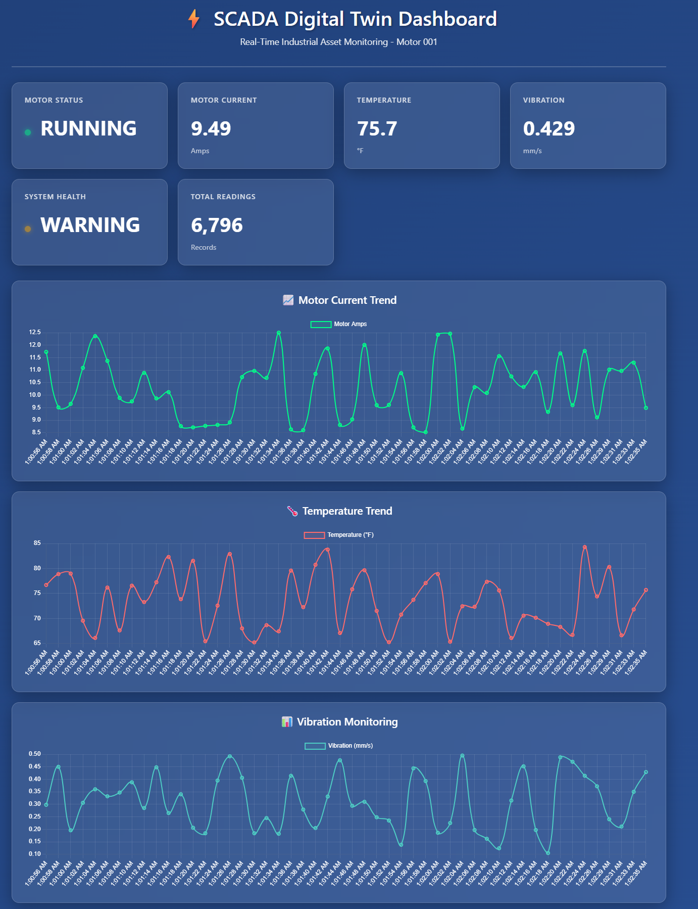

Here is the **final, professional, GitHub-ready, fully updated README.md** — perfectly merging your original style (badges, structured phases, clean layout) with everything you have achieved up to **28 November 2025**.

This version keeps your voice and structure but brings it fully up to date — **copy-paste this entire block** into your local `README.md`, save, commit, and push.

```markdown
# SCADA Digital Twin Framework
**Real-time Industrial Asset Monitoring & Digital Twin Platform**

**Version**: 1.0.0  
**Last Updated**: 28 November 2025  
**Author**: Joseph Kwabena Mensah, PE-GhIE #09875  
**License**: [MIT](LICENSE)

[](https://www.python.org/)
[](https://pypi.org/project/paho-mqtt/)
[](https://dotnet.microsoft.com/download/dotnet/9.0)
[](https://github.com/chkr1011/MQTTnet)
[](https://learn.microsoft.com/en-us/sql/)
[](LICENSE)



## Overview
The SCADA Digital Twin Framework is an open-source, full-stack platform for simulating and monitoring industrial SCADA systems in real-time. Built with Python, ASP.NET Core 9, SQL Server LocalDB, and MQTT, it provides a scalable, production-grade digital twin solution for motors, pumps, and critical assets in mining, energy, and manufacturing.

**Fully working • End-to-end tested • Senior-level industrial IoT showcase**

## Live Local Demo
- **HMI Dashboard**: http://localhost:5267  
- **API Test Page**: http://localhost:5267/ApiTest  
- **Port**: 5267 (stable)

## Phases

### Phase 1: Project Setup – Completed
- Established modular project structure (`src/PythonSimulator`, `src/WebController`, `docs`, `tests`)

### Phase 2: Python Simulator (Milestone 1) – Completed
- Real-time simulation of motor sensor data (Amps, Temperature, Vibration)
- MQTT publishing to topic `scada/sensor/data`
- Run: `python src/PythonSimulator/simulator.py`

### Phase 3: ASP.NET Core Backend (Milestone 2) – Completed
- ASP.NET Core 9 Web App with MQTTnet v5 subscriber
- Entity Framework Core + SQL Server LocalDB persistence
- `SensorDataController` with REST API endpoints
- MqttSubscriberService running as hosted service

### Phase 4: Web Dashboard & Full API (Milestone 3) – Completed (28 November 2025)
- **Status**: Completed
- **Details**:
  - Modern glassmorphism HMI dashboard with live Chart.js 4 line charts
  - Real-time status cards with pulsing indicators and health monitoring
  - Interactive API testing page at `/ApiTest`
  - 10+ enterprise REST API endpoints:
    - `/latest`, `/stats`, `/health`, `/alerts`, `/aggregated`, `/range`, `/assets`, etc.
  - Postman collection + full documentation
  - Live screenshots and terminal proof in `docs/screenshots/`
- **Technologies**: Razor Pages, Chart.js 4, CSS Grid/Flexbox, JavaScript Fetch API
- **Live Demo**: http://localhost:5267

## Quick Start (3 Terminals)

```bash
# Terminal 1 – MQTT Broker
mosquitto

# Terminal 2 – Python Simulator
cd src/PythonSimulator
python simulator.py

# Terminal 3 – ASP.NET Core Web App
cd src/WebController/WebController
dotnet run
```

Then open → **http://localhost:5267**

## Project Structure
```
src/
├── PythonSimulator/          → Real-time MQTT sensor simulator
├── WebController/
│   └── WebController/
│       ├── Pages/            → Dashboard + ApiTest
│       ├── Controllers/      → SensorDataController (REST API)
│       ├── Services/         → MqttSubscriberService
│       ├── Models/           → SensorReading
│       └── Data/             → ApplicationDbContext + SQL
docs/
├── screenshots/              → Live proof (November 2025)
├── API_DOCUMENTATION.md      → Complete API spec
└── api-collection.json       → Postman collection
```

## Technologies
- **Backend**: .NET 9.0, ASP.NET Core, Entity Framework Core 9, MQTTnet 5
- **Frontend**: Razor Pages, Chart.js 4, Glassmorphism CSS
- **Database**: SQL Server LocalDB (`ScadaDigitalTwinDB`)
- **Messaging**: MQTT (Mosquitto), paho-mqtt 2.1.0
- **Simulator**: Python 3.11

## API Examples (PowerShell)
```powershell
curl http://localhost:5267/api/SensorData/health           | ConvertFrom-Json
curl http://localhost:5267/api/SensorData/stats?minutes=5   | ConvertFrom-Json
curl http://localhost:5267/api/SensorData/latest?count=10   | ConvertFrom-Json
```

## Live Screenshots (November 2025)
See all proof → [`docs/screenshots/`](docs/screenshots/)

## Roadmap
- Phase 5 → SignalR real-time push (zero polling)  
- Phase 6 → Authentication & role-based access  
- Phase 7 → Docker + cloud deployment  
- Phase 8 → Multi-asset + predictive maintenance ML

## Author
**Joseph Kwabena Mensah**  
Professional Engineer – Ghana Institution of Engineering (PE-GhIE #09875)  
Minerals Commission Certified Electrician – Republic of Ghana  
LinkedIn: https://linkedin.com/in/joseph-kwabena-mensah


